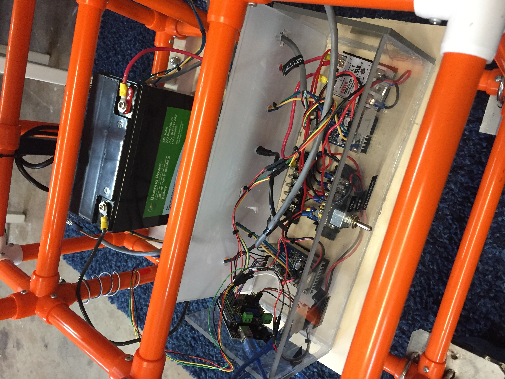

# PVC Powerchair

Pediatric powerchair initially developed at BYU and the [Open Wheelchair Foundation](http://openwheelchair.org/).

This project tracks enhancements to the chair made by [Robomakery](http://robomakery.com).

## Project Summary

[Short Google Slides Presentation](https://docs.google.com/presentation/d/e/2PACX-1vQH72_SPbROlJtIxm5qiG1kyvUSaIGlaVXuoVhn0pRb-agA25kUbpgHu_BZxM33IaVWwLDGMfL6djqC/pub?start=false&loop=false&delayms=3000)

## Getting Involved

We welcome new contributors!

First, there is a Google Group mailing list for development discussion:

https://groups.google.com/forum/?hl=en#!forum/robomakery-pvc-chair

Please join that group and introduce yourself.  We also have bi-weekly online planning meetings via Zoom.

If you are in the San Diego area, we also meet to discuss this project on the first Tuesday of every month as part of the [San Diego Robotics Club](https://www.meetup.com/roboticsclub/).

## Versions

### Version 1

Theme: Original design build

Updates:

* Minor changes to original design

Prototype Completion Date: 2016-04-27

[read more](v1)

### Version 2

Theme: Move to COTS electronics

Updates:

* Arduino instead of custom boards
* Sabertooth Motor Controller
* OLED Battery Display
* Plug-in Battery Charging

Prototype Completion Date: 2017-11-04

[read more](v2)

### Version 3

Theme: UCSD ECE 191 Winter / Spring Projects

Updates:

* Brushless Hub Motors with Hall Sensors
* LiFePo4 Battery
* Rear-wheel drive

Prototype Completion Date: 2018-06-15

[read more](v3)

### Version 4

Theme: Metal Frame, oDrive, Initial ROS

Updates:

* oDrive Motor Controller
* oDrive Brushless Motors + encoders + gearbox
* oDroid ROS Control
* Metal Frame w/ MakerPipe
* Front-wheel drive

Prototype Completion Date: Build In Progress

[read more](v4)

### Version 5

Theme: Rocker-Bogie Experiement

Updates:

* Rocker-Bogie Suspension
* Self-leveling seat

Prototype Completion Date: TBD

[read more](v5)

## License Information

[Software is licensed under GNU General Public License V3](SOFTWARE_LICENSE)

[Hardware is licensed under CERN Open Hardware Licence v1.2](HARDWARE_LICENSE)

## Gallery

Version 1

Version 2 (click on image to see video)

Version 3

