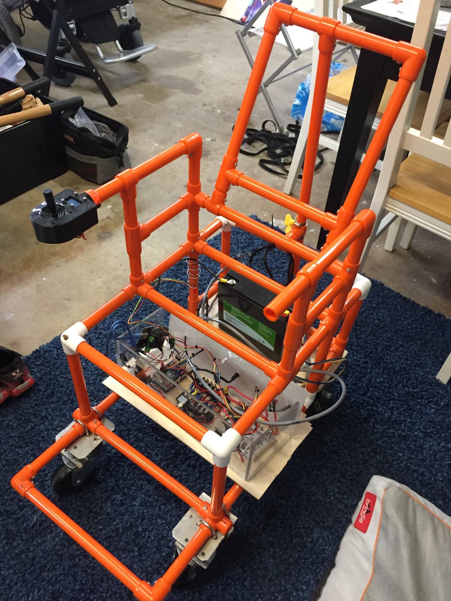
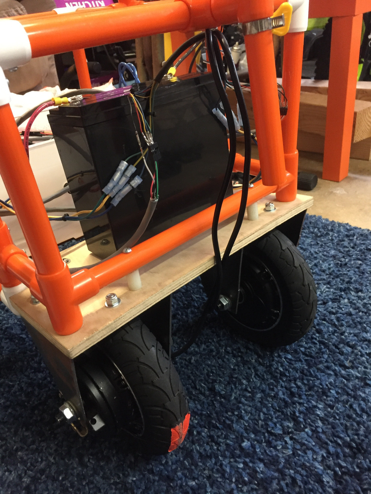

### Version 5

Theme: Rocker-Bogie Experiment

Updates:

* Rocker-Bogie Suspension
* Self-leveling seat

Prototype Completion Date: TBD

[read more](v5)

### Version 4

Theme: Metal Frame, oDrive, Initial ROS

Updates:

* oDrive Motor Controller
* oDrive Brushless Motors + encoders + gearbox
* oDroid ROS Control
* Metal Frame w/ MakerPipe
* Front-wheel drive

Prototype Completion Date: Build In Progress

[read more](v4)

### Version 3

Theme: UCSD ECE 191 Winter / Spring Projects

Updates:

* Brushless Hub Motors with Hall Sensors
* LiFePo4 Battery
* Rear-wheel drive

Prototype Completion Date: 2018-06-15

[read more](v3)

### Version 2

Theme: Move to COTS electronics

Updates:

* Arduino instead of custom boards
* Sabertooth Motor Controller
* OLED Battery Display
* Plug-in Battery Charging

Prototype Completion Date: 2017-11-04

[read more](v2)

### Version 1

Theme: Original design build

Updates:

* Minor changes to original design

Prototype Completion Date: 2016-04-27

[read more](v1)
