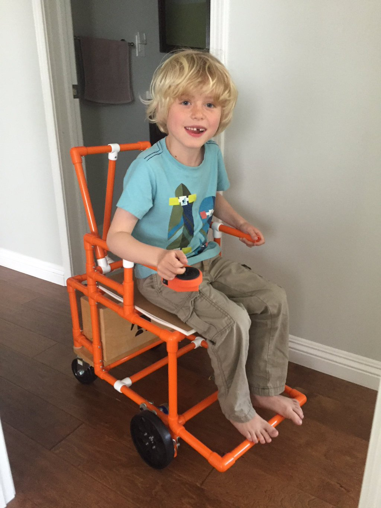

## PVC Chair Version 1

Prototype completed: 2016-04-27

Initially developed by BYU project:

http://capstone.byu.edu/previous-projects/open-source-wheelchair

Then continued by the Open Wheelchair Foundation at:

http://www.openwheelchair.org/

This build was based on the original build documentation is located at:

http://www.openwheelchair.org/Plans/

### Gallery

